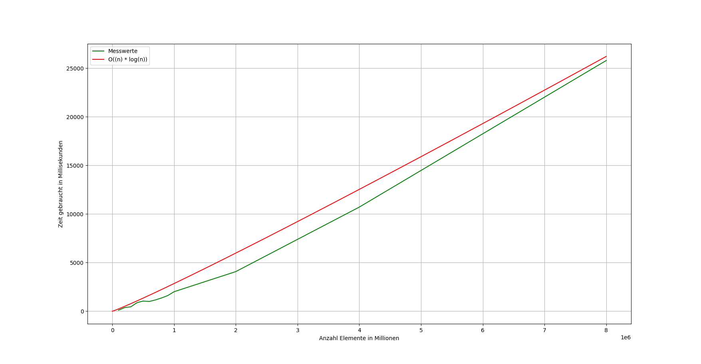

# Heap Sort für Strings
## von Farsad Arianfar und Yannick Reiß

1. ### Das Programm
Das Programm misst nach der Ausführung die Zeit für das Sortieren eines Arrays von 16 Zeichen langen Strings in den gegebenen Größen.

2. ### Anweisungen zum Bauen / Regeln der Makefile
Um das Programm zu bauen werden die Programme **make** und **gcc** benötigt.

Die Befehle der Makefile sind:
- `make` um das Programm zu bauen
- `make run` um das Programm zu bauen, bei Erfolg auszuführen und anschließend `make clean` auszuführen
- `make clean` um alle Objektdateien und das Programm zu löschen

3. ### Einstufung der Laufzeit, Ergebnisse der Laufzeitermittlung
Die Laufzeit des HeapSort beträgt `n * log2(n)` mit der ungefähren Konstanten c = 1/8100. 
